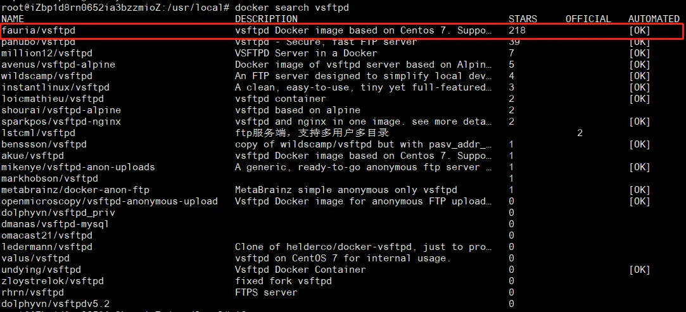
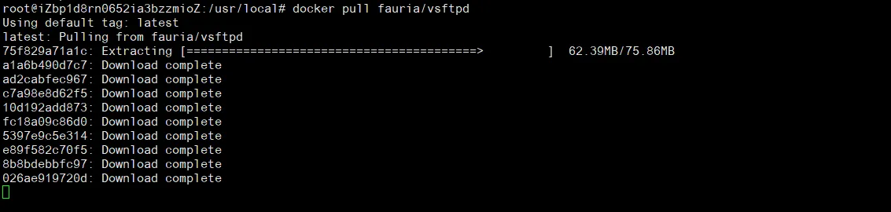
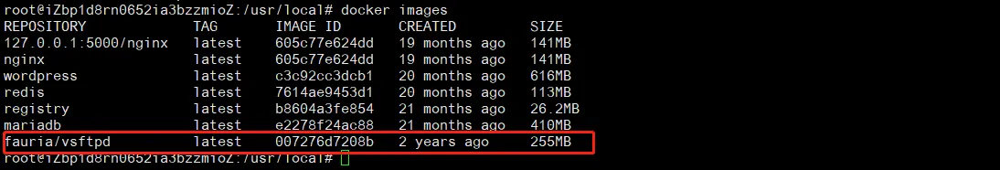
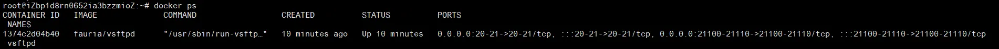
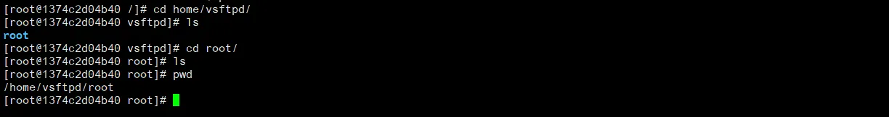

## 1、介绍
vsftp 是一款免费开源的 UNIX/LINUX 上的 FTP 服务器软件，以安全、快速、稳定、开源（基于GPLv2协议开源）著称。
## 2、搭建
搭建顺序：镜像查询、镜像拉取、镜像启动、访问FTP
### 2.1 镜像查询

```
docker search vsftpd
```


### 2.2 镜像拉取
选择使用STARS最多的使用的，拉取后查询是否下载成功

```
docker pull fauria/vsftpd
```

```
docker images
```

### 2.3 镜像启动
#### 2.3.1 命令准备

```
docker run -d -v /home/vsftpd:/home/vsftpd -p 20:20 -p 21:21 -p 21100-21110:21100-21110 -e FTP_USER=root -e FTP_PASS=123321 --name vsftpd fauria/vsftpd
```

#### 2.3.2 命令说明

```
docker run -d ->运行容器。
-v /home/vsftpd:/home/vsftpd -> -v (宿主机目录:容器目录) 将宿主机的目录和容器的目录挂载到一起，绑定之后宿主机有的文件容器中也有，反之相同。
-p 20:20 -p 60021: 21 -p 21100-21110 -> -p (宿主端口：容器端口), 其中端口20（数据端口）用于进行数据传输，端口21（命令端口）用于接受客户端发出的相关FTP命令与参数。
-e FTP_USER=root -e FTP_PASS=123321 ->指定环境变量，登录ftp的时候需要的用户名和密码
--name vsftpd fauria/vsftpd -> --name (容器名 镜像名)
--restart=always 重启Dokcer时，自动启动容器
```

#### 2.3.3 端口开放

开放端口：20、21、21100-21110
ECS的话，去配置安全组即可
虚拟机或其他机器，开放端口可用命令。

```
#开启20防火墙端口
firewall-cmd --zone=public --add-port=20/tcp --permanent
#开启21防火墙端口
firewall-cmd --zone=public --add-port=21/tcp --permanent
#开启21100-21110防火墙端口
firewall-cmd --zone=public --add-port=21100-21110/tcp --permanent
#重启防火墙
firewall-cmd --reload
#查看防火墙已经启动的端口
firewall-cmd --zone=public --list-ports
```

## 2.4 启动情况
```
docker ps -a
```



## 2.5 容器内部

```
docker exec -it 容器id /bin/bash
```

