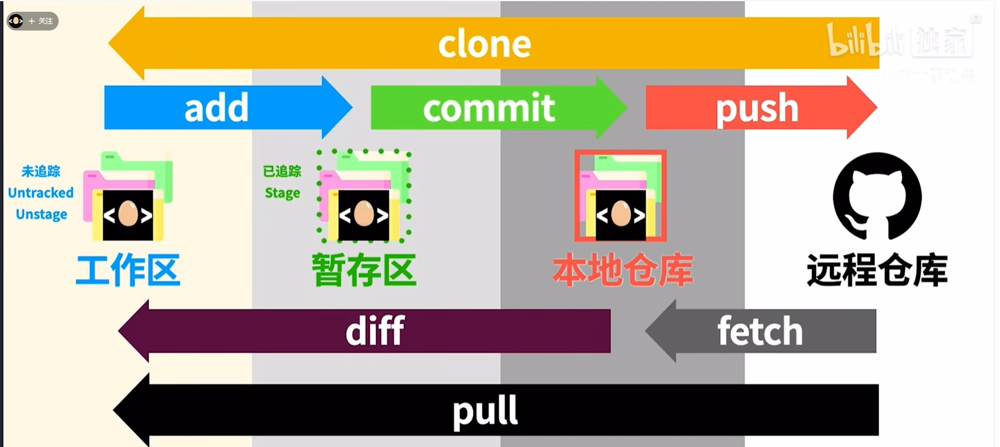

## Git 历史介绍

Git 是 Linux 作者 Linus 的一个作品。2002 年他还在使用 Bitkeeper 作为 Linux 内核的版本管理，但因为它是 Copyright 有版权的软件备受质疑，然后 Andrew Tridgell 对 Bitkeeper 进行逆向工程，导致 BitMover 要回收 Linux 开发者的 Bitkeeper 的免费使用权，Linus 一怒之下花了 10 天写出了 Git。

如今 Git 已经成为绝大多数开发者的选择， Tom Preston-Werner、Chris Wanstrath 和 PJ Hyett 在 2007 年 10 月推出的 Github 已经成为了全球最大的开发者交友平台。

## 什么是 Git

Git 是一个分布式版本控制系统。是目前世界上最流行的源代码管理工具，广泛应用于软件开发中。

怎么理解版本控制？我们公司使用的 PLM 系统，对于图纸或者物料卡片的有效管理也是一种版本控制的体现，让产品从 0 到 1 落地时，每个环节得到有效的控制和管理。

版本控制，是一种记录文件或代码变更历史的方法，能够记录每次变更（某某人在某某时间做了什么修改）、版本回退（出了问题马上回退到之前稳定版本）、比较差异（查看不同版本之间的差异，理解变更的内容）。对于产品开发环节上的关键人来说，一方面可以提高开发效率，降低出错风险。另外一方面，可查看每个节点的产品状态，了解项目怒的发展历程，促进团队之间协作。

## 核心原理


## Git 基础

安装 Git 以及配置 Git 不做说明，网上有很多参考文档。

```
git --version   // 查看git的版本信息
git config --global user.name "你的名字"  // 登录的用户
git config --global user.email "你的邮箱信息" // 登录用户的邮箱 
```

## Git 常用命令

Git 本身是个命令行工具。

### 创建仓库
```

```

### 添加文件到仓库

### 分支创建与合并


## Git 分支命名

### master/main 分支

master 为主分支，也是用于部署生产环境的分支，确保 master 分支稳定性， master 分支一般由develop以及hotfix分支合并，任何时间都不能直接修改代码。

### develop 分支

develop 为开发分支，始终保持最新完成以及 bug 修复后的代码，一般开发的新功能时，feature 分支都是基于 develop 分支下创建的。

### feature 分支
 
开发新功能时，以 develop 为基础创建 feature 分支。分支命名: feature/ 开头的为特性分支， 命名规则: feature/user_method、 feature/create_method

### release分支

release 为预上线分支，发布提测阶段，会 release 分支代码为基准提测。当有一组 feature 开发完成，首先会合并到 develop 分支，进入提测时会创建 release 分支。如果测试过程中若存在 bug 需要修复，则直接由开发者在 release 分支修复并提交。当测试完成之后，合并release分支到 master 和 develop 分支，此时 master 为最新代码，用作上线。

### hotfix 分支

分支命名: hotfix/ 开头的为修复分支，它的命名规则与 feature 分支类似。线上出现紧急问题时，需要及时修复，以 master 分支为基线，创建 hotfix 分支，修复完成后，需要合并到 master 分支和 develop 分支。

## 常见操作说明

### 增加新功能
```
(dev)$: git checkout -b feature/xxx            # 从dev建立特性分支
(feature/xxx)$: xxxxxx                         # 开发
(feature/xxx)$: git add xxxxxx
(feature/xxx)$: git commit -m 'commit comment'
(dev)$: git merge feature/xxx --no-ff          # 把特性分支合并到dev
```

### 修复紧急 bug
```
(master)$: git checkout -b hotfix/xxx         # 从master建立hotfix分支
(hotfix/xxx)$: blabla                         # 开发
(hotfix/xxx)$: git add xxx
(hotfix/xxx)$: git commit -m 'commit comment'
(master)$: git merge hotfix/xxx --no-ff       # 把hotfix分支合并到master，并上线到生产环境
(dev)$: git merge hotfix/xxx --no-ff          # 把hotfix分支合并到dev，同步代码
```

### 测试环境代码
```
(release)$: git merge dev --no-ff             # 把dev分支合并到release，然后在测试环境拉取并测试
```

### 生产环境上线
```
(master)$: git merge release --no-ff          # 把release测试好的代码合并到master，运维人员操作

## git tag -a tag_name -m "描述信息"
(master)$: git tag -a v1.0.0 -m "第一个版本包" # 创建带有说明的标签,用-a指定tag名,-m指定说明文字
```

## 提交规范说明

说在前面，编写良好的 Commit messages 可以达到 3 个重要的目的：

- 提高团队 代码Review 效果；
- 帮助我们编写良好的版本发布日志，让审批人员看的清晰，方便通过；
- 有助于之后的维护者了解代码里出现特定变化和 feature 被添加的原因；


项目开发过程中，作为开发人员经常需要提交代码来修复 bug 或者实现新的功能。我们可能会逐渐忘记某些文件的具体作用，以及它们是如何解决特定问题的。这不仅会浪费我们回顾代码的时间，也可能影响团队的协作效率。所以编写清晰、规范的 commit messages 不仅有助于团队成员快速把握每次提交的核心内容，而且也是衡量一个开发人员是否具备良好协作精神的重要标准。


目前，社区有多种 Commit message 的写法规范。当前业界应用的比较广泛的是 `Angular Git Commit Guidelines` ：https://github.com/angular/angular.js/blob/master/DEVELOPERS.md#-git-commit-guidelines。

### 格式说明

```
<type>: <subject>
<BLANK LINE>
<body>
<BLANK LINE>
<footer>
```

### Type 类别说明

- **feat**: 添加新特性
- **fix**: 修复bug
- **docs**: 仅仅修改了文档
- **style**: 仅仅修改了空格、格式缩进、都好等等，不改变代码逻辑
- **refactor**: 代码重构，没有加新功能或者修复bug
- **perf**: 增加代码进行性能测试
- **test**: 增加测试用例
- **chore**: 改变构建流程、或者增加依赖库、工具等

### Commit messages格式

```
# 标题行：50个字符以内，描述主要变更内容。强调几点: 使用祈使句，是不是很熟悉又陌生的一个词、首字母不要大写、结尾无需添加标点。
#
# 主体内容：更详细的说明文本，建议72个字符以内。需要描述的信息包括:
#
# * 为什么这个变更是必须的? 它可能是用来修复一个bug，增加一个feature，提升性能、可靠性、稳定性等等
# * 他如何解决这个问题? 具体描述解决问题的步骤
# * 是否存在副作用、风险?
#
# 如果需要的化可以添加一个链接到issue地址或者其它文档 如 #123（关联某个 issue）
```

