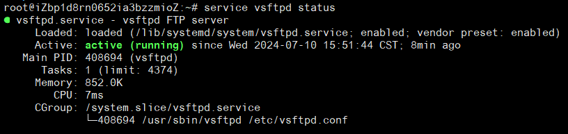

## 检测是否已安装vsftpd

**使用 `vsftpd` 的版本命令：**

```
vsftpd -version
```

**使用 `which` 检测：**

```
which vsftpd
```
如果 `vsftpd` 已安装，该命令将返回 `vsftpd` 的安装路径。反之，则不输出。

```
root@iZbp1d8rn0652ia3bzzmioZ:~# which vsftpd
/usr/sbin/vsftpd
```

**对于 `Ubuntu/Debian`，也可以使用 `dpkg` ：**

```
dpkg -l | grep vsftpd
```
```
root@iZbp1d8rn0652ia3bzzmioZ:~# dpkg -l | grep vsftpd
ii  vsftpd 3.0.5-0ubuntu1 amd64 lightweight, efficient FTP server written for security
```

**对于 `CentOS/Red Hat`，可以使用 `rpm`：**

```
rpm -q vsftpd
```

## 安装 vsftpd
```
apt install vsftpd
```
安装结束后，通过查看版本号验证是否安装成功。输出版本号 `vsftpd: version 3.0.5`,表明安装成功。
```
vsftpd -v
```
```
root@iZbp1d8rn0652ia3bzzmioZ:~# vsftpd -v
vsftpd: version 3.0.5
```

## 配置 vsftpd

`vsftpd` 安装成功后，需要对其进行一些基本配置。

**提示：配置前，建议先备份原始的配置文件，防止出错可恢复。**

```
cp /etc/vsftpd.conf /etc/vsftpd.conf.bak
```

### 查看默认配置文件信息
```
cat /etc/vsftpd.conf | grep -v '#'

# 监听IPv4 sockets
listen=NO

# 监听IPv6 sockets
listen_ipv6=YES

# 禁止匿名登录FTP服务器
anonymous_enable=NO

# 允许本地用户登录FTP服务器
local_enable=YES

dirmessage_enable=YES
use_localtime=YES
xferlog_enable=YES
connect_from_port_20=YES
secure_chroot_dir=/var/run/vsftpd/empty
pam_service_name=vsftpd
rsa_cert_file=/etc/ssl/certs/ssl-cert-snakeoil.pem
rsa_private_key_file=/etc/ssl/private/ssl-cert-snakeoil.key
ssl_enable=NO
```


### 主动模式

主动模式适用于内网环境下进行，常见的云服务器采用的公网 FTP 模式，请使用被动模式。

```
vim /etc/vsftpd.conf

# 修改如下参数

# 全部用户被限制在主目录
chroot_local_user=YES
# 启用例外用户名单
chroot_list_enable=YES
# 指定例外用户列表文件，列表中的用户不被锁定在主目录
chroot_list_file=/etc/vsftpd/chroot_list  
allow_writeable_chroot=YES
# 设置本地用户登录后所在的目录
local_root=/var/ftp/test 
```


### 被动模式


## 查看 vsftpd 状态

### 查看 vsftpd 是否启动
```
service vsftpd status
```


### vsftpd 启动、重启、停止、重新加载配置
```
# 启动
service vsftpd start

# 重启
service vsftpd restart

# 停止
service vsftpd stop

# 重新加载配置
service vsftpd reload
```

## 卸载 vsftpd

> **卸载前，请先停止服务！！！**

### 卸载 vsftpd 软件包
```
apt remove vsftpd
```

```
root@iZbp1d8rn0652ia3bzzmioZ:~# apt remove vsftpd
Reading package lists... Done
Building dependency tree... Done
Reading state information... Done
The following package was automatically installed and is no longer required:
  ssl-cert
Use 'apt autoremove' to remove it.
The following packages will be REMOVED:
  vsftpd
0 upgraded, 0 newly installed, 1 to remove and 38 not upgraded.
After this operation, 326 kB disk space will be freed.
Do you want to continue? [Y/n] y
(Reading database ... 82556 files and directories currently installed.)
Removing vsftpd (3.0.5-0ubuntu1) ...
Processing triggers for man-db (2.10.2-1) ...
```

### 彻底删除 vsftpd 配置文件和数据
```
apt purge vsftpd
```

```
root@iZbp1d8rn0652ia3bzzmioZ:~# apt purge vsftpd
Reading package lists... Done
Building dependency tree... Done
Reading state information... Done
The following package was automatically installed and is no longer required:
  ssl-cert
Use 'apt autoremove' to remove it.
The following packages will be REMOVED:
  vsftpd*
0 upgraded, 0 newly installed, 1 to remove and 38 not upgraded.
After this operation, 0 B of additional disk space will be used.
Do you want to continue? [Y/n] y
(Reading database ... 82504 files and directories currently installed.)
Purging configuration files for vsftpd (3.0.5-0ubuntu1) ...

```

### 清理系统中残留的依赖包和不再需要的软件包
```
apt autoremove
```

通过以上几个步骤，我们可以成功地将 vsftpd 服务从 Linux 系统卸载删除掉，请谨慎使用。生产环境下请核实操作，必要造成事故。


