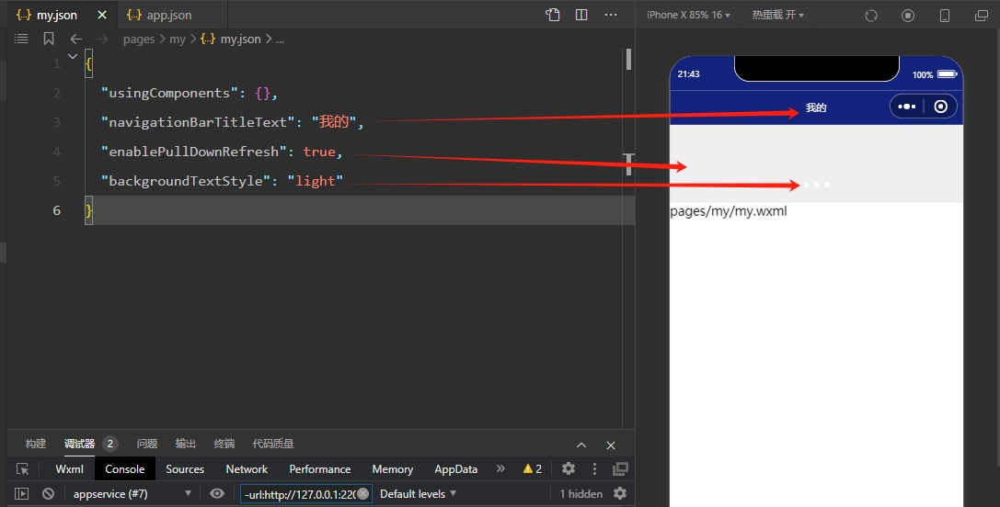

## 页面配置文件 page.json

小程序页面配置文件，也称局部配置文件，用于配置当前页面的窗口样式、页面标题等；每一个小程序页面也可以使用自己的 `.json` 文件来对本页面的窗口表现进行配置。需要注意的是：页面配置文件的属性和全局配置我呢间中的 `window` 属性几乎一致，只不过这里不需要额外指定 `window` 字段。因此如果出现相同的配置项，页面中配置项会覆盖全局配置文件中的配置项。(也就是局部配置覆盖全局配置)

**官方文档参考**：https://developers.weixin.qq.com/miniprogram/dev/reference/configuration/page.html

```
{
  "usingComponents": {},
  "navigationBarTitleText": "我的",
  "enablePullDownRefresh": true,
  "backgroundTextStyle": "light"
}
```

- usingComponents 页面自定义组件配置
- navigationBarTitleText 导航栏标题文字内容
- enablePullDownRefresh 是否开启当前页面下拉刷新
- backgroundTextStyle 下拉 loading 的样式，仅支持 dark / light
 


 