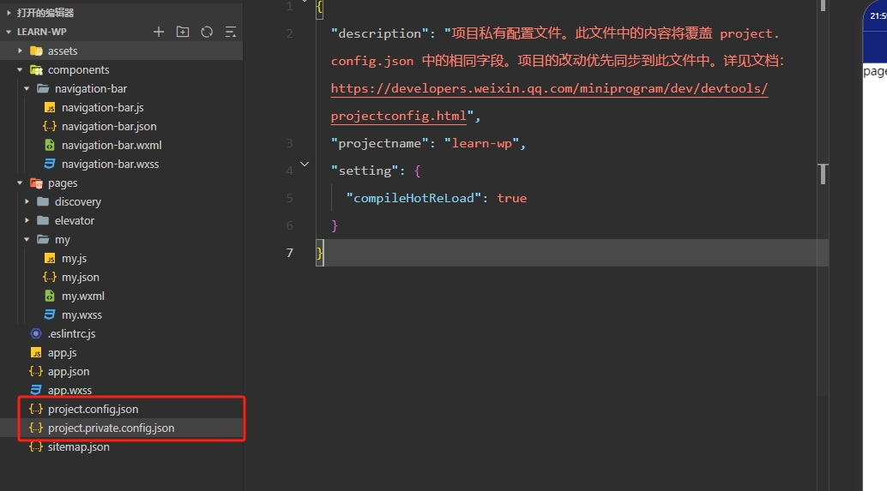

## 一、项目配置文件

在创建项目的时候，每个项目的根目录生成两个 config.json 文件，用于保存开发者在工具上做的个性化配置。例如：和编译有关的配置。当重新安装微信开发者工具或者换电脑工作时，只要载入同一个项目的代码包，开发者工具就会自动恢复到当时开发项目时的个性化配置。

项目根目录中的 `project.config.json` 和 `project.private.config.json` 文件都可以对项目进行配置：

- **project.config.json**：项目配置文件，常用来进行配置公共的配置；
- **project.private.config.json**：项目私有化配置，常用来配置个人的配置；



### 1.1 project.config.json

```
{
  "appid": "wx61c891576cbaa96a",
  "compileType": "miniprogram",
  "libVersion": "3.5.6",
  "packOptions": {
    "ignore": [],
    "include": []
  },
  "setting": {
    "coverView": true,
    "es6": true,
    "postcss": true,
    "minified": true,
    "enhance": true,
    "showShadowRootInWxmlPanel": true,
    "packNpmRelationList": [],
    "babelSetting": {
      "ignore": [],
      "disablePlugins": [],
      "outputPath": ""
    },
    "condition": false
  },
  "condition": {},
  "editorSetting": {
    "tabIndent": "insertSpaces",
    "tabSize": 2
  }
}
```

### 1.2 project.private.config.json

```
{
  "description": "项目私有配置文件。此文件中的内容将覆盖 project.config.json 中的相同字段。项目的改动优先同步到此文件中。详见文档：https://developers.weixin.qq.com/miniprogram/dev/devtools/projectconfig.html",
  "projectname": "learn-wp",
  "setting": {
    "compileHotReLoad": true
  }
}
```

## 二、官方文档

https://developers.weixin.qq.com/miniprogram/dev/devtools/projectconfig.html


## 三、注意事项

1、`project.private.config.json` 写到 `.gitignore` 避免版本管理的冲突
2、与最终编译结果有关的设置必须设置到 `project.config.json` 中


