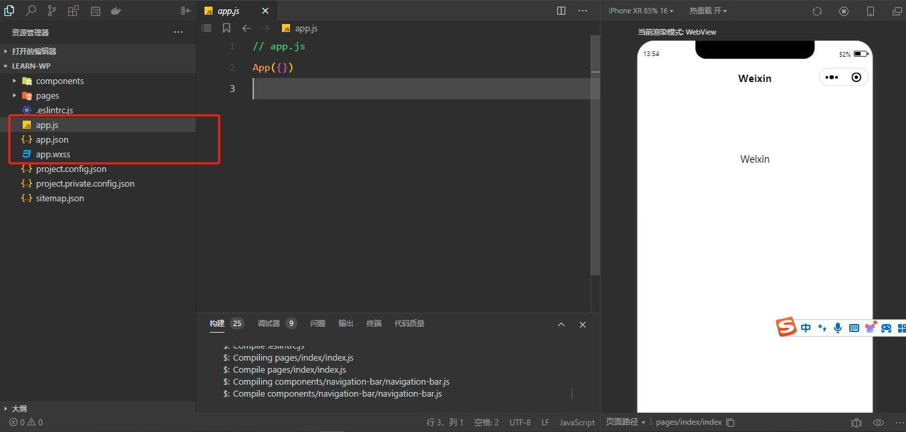
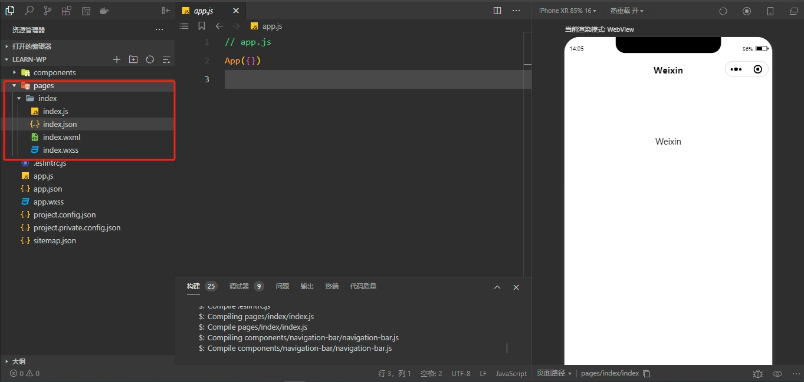
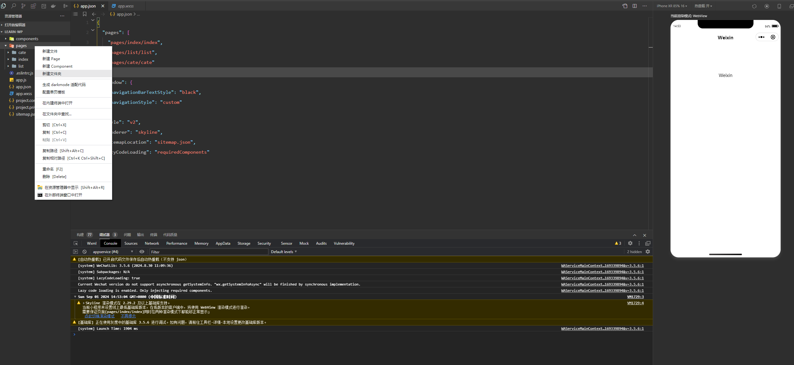
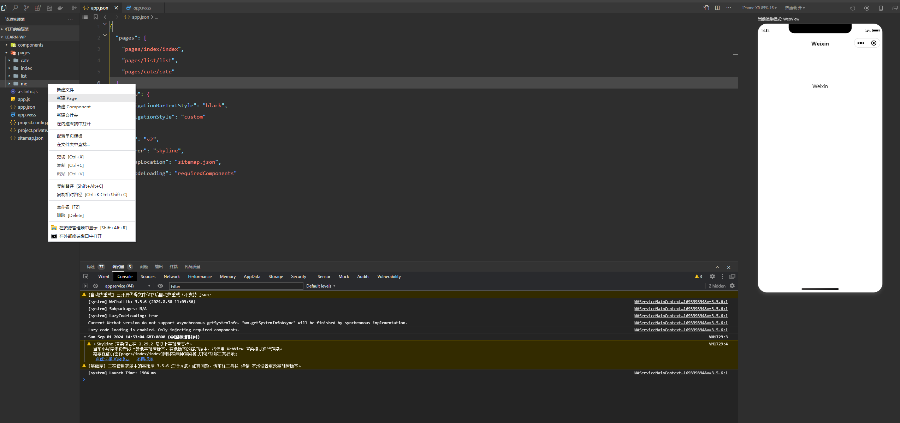
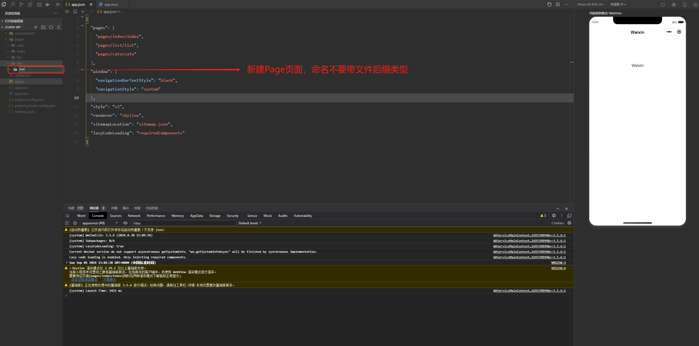
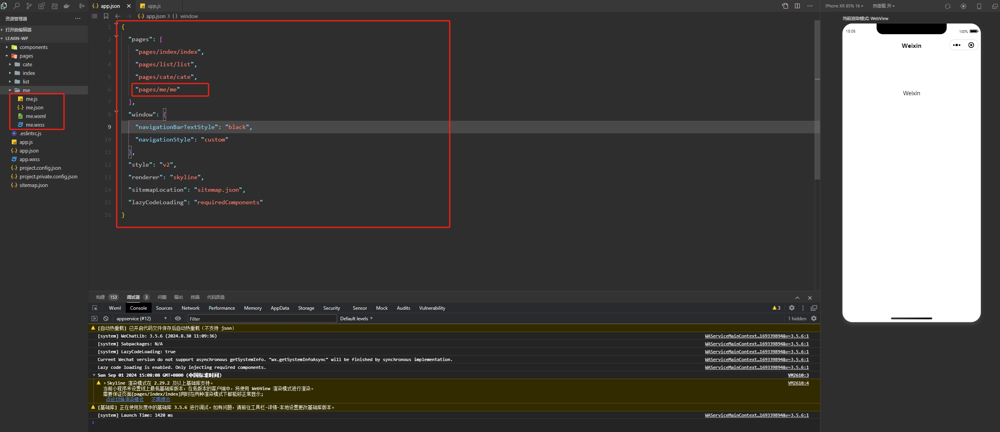
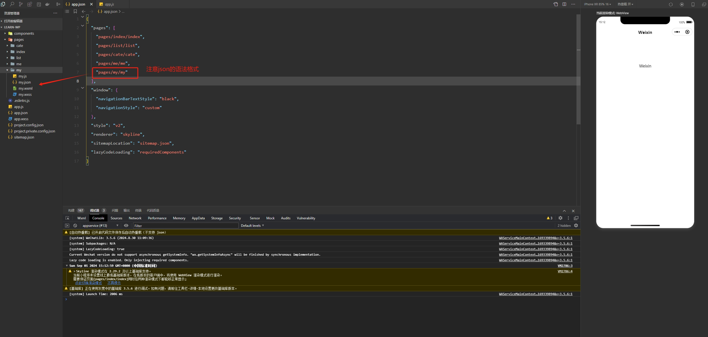

一个完整的小程序项目分为两个部分：**主体文件**、**页面文件**

## 主体文件

主体文件，又称为全局文件，能够作用于整个小程序，影响到小程序的每个页面，主体文件必须放到项目的根目录下。



主体文件由三个部分组成：

- **app.js**：小程序入口文件，用于配置小程序的生命周期、全局事件处理函数、全局样式、全局方法等；
- **app.json**：小程序的全局配置文件，用于配置小程序的窗口表现、导航条、TabBar、页面栈等；
- **app.wxss**：小程序的全局样式，用于配置小程序的全局样式，如字体、颜色、背景等；

> **注意事项：**

主体文件的名字必须是 app，app.js 和 app.json 文件是必须存在的！

## 页面文件

页面文件，又称为子页面，每个页面都是一个独立的小程序页面，页面文件必须放到项目的 pages 目录下，一个页面一个文件夹。



每个页面通常由四个文件组成，每个文件只对当前页面有效：

- **.js**：页面逻辑文件，用于配置页面的生命周期、事件处理函数、页面数据、页面样式等；
- **.json**：页面的配置文件，用于配置页面的窗口表现、导航条、TabBar、页面栈等；
- **.wxml**：页面的模板文件，用于配置页面的结构和组件；
- **.wxss**：页面的样式文件，用于配置页面的样式，如字体、颜色、背景等；

> **注意事项：**

.js 文件 和 .wxml 文件是必须存在的！


## 新建页面

### 方式一：通过目录新建页面

1、在 `pages` 目录下新建一个页面，右键 `pages` 目录，选择 `新建文件夹`，如：新建一个我的页面，新建的页面名为 me



2、右键 pages/me 目录，选择 `新建Page`，不带文件后缀类型







### 方式二：通过 app.json 新建页面

在 `app.json` 文件中 `pages` 数组中添加一个新的页面路径保存自动即可自动新增页面，注意 `json` 语法格式。

> **新增前：**

```json
{
  "pages": [
    "pages/index/index",
    "pages/list/list",
    "pages/cate/cate",
    "pages/me/me"
  ],
  "window": {
    "navigationBarTextStyle": "black",
    "navigationStyle": "custom"
  },
  "style": "v2",
  "renderer": "skyline",
  "sitemapLocation": "sitemap.json",
  "lazyCodeLoading": "requiredComponents"
}
```

> **新增后：**

```json
{
  "pages": [
    "pages/index/index",
    "pages/list/list",
    "pages/cate/cate",
    "pages/me/me",
    "pages/my/my"
  ],
  "window": {
    "navigationBarTextStyle": "black",
    "navigationStyle": "custom"
  },
  "style": "v2",
  "renderer": "skyline",
  "sitemapLocation": "sitemap.json",
  "lazyCodeLoading": "requiredComponents"
}
```



 