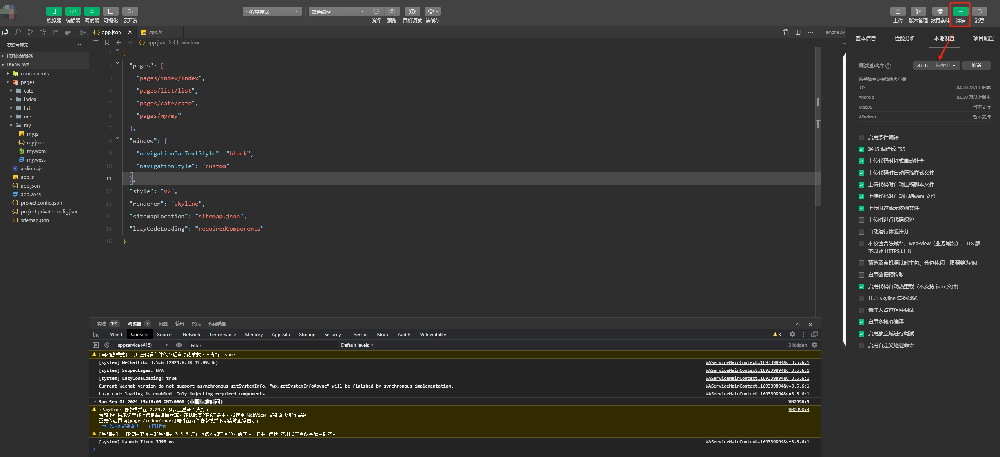
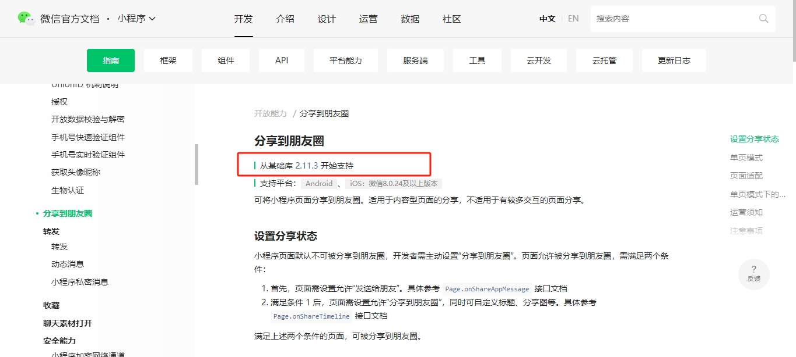

## 介绍

**小程序调试基础库**，微信开发者工具中可以选择的微信基础库版本。

**微信基础库**，小程序的运行环境，给小程序提供了运行所需要的各种 API 和工具，以及基础框架和逻辑运行等。

小程序开发者可以在微信开发者工具中选择所需的微信基础库版本，作为运行和调试小程序时的运行环境。每个小程序有自己所允许使用的基础库最低版本要求，开发者需要选择要兼容的基础库版本，从而确保小程序的功能正常运行。

## 版本变更

微信开发者工具中点击`详情`,选择`本地设置`，调试基础库版本可供自己需要选择调整。

## 作用说明

