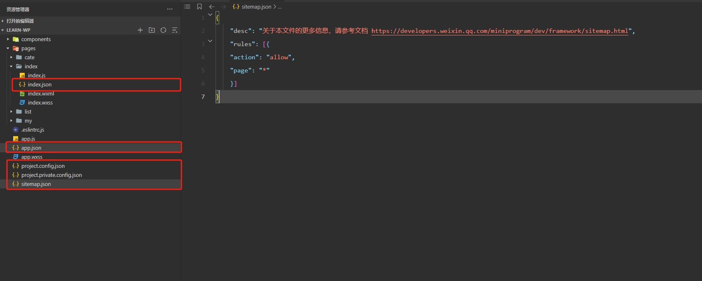

## 配置文件

`JSON` 是一种轻量级的数据格式，常用于前后端数据的交互，但是在小程序中，`JSON` 扮演的配置项的角色，用于配置项目或者页面属性和行为，每个页面或者组件也都有一个对应的 json 文件。

小程序中常见的配置文件有以下几种：

1、`app.json`：小程序全局配置文件，用于配置小程序的一些全局属性和页面路由；

2、`页面.json`：小程序页面配置文件，也称局部配置文件，用于配置当前页面的窗口样式、页面标题等；

3、`project.config.json`：小程序项目配置文件，用于保存项目的一些配置信息和开发者的个人设置；

4、`sitemap.json`：配置小程序及其页面是否允许被微信索引，提高小程序在搜索引擎搜到的概率；
