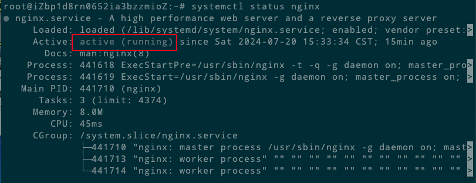

# 1、准备工作

## 1.1 查看系统信息
```
cat /etc/issue

root@iZbp1d8rn0652ia3bzzmioZ:~# cat /etc/issue
Ubuntu 22.04.4 LTS \n \l
```

## 1.2 `Nginx` 相关的依赖包：

```
# gcc编译器是否安装
sudo apt-get install gcc
 
# pcre库是否安装
sudo apt-get install libpcre3 libpcre3-dev
 
# zlib库是否安装
sudo apt-get install zlib1g zlib1g-dev
 
# openssl库是否安装
sudo apt-get install openssl 
 
sudo apt-get install libssl-dev
```

# 2、安装方式介绍

## 2.1 使用 `apt-get` 安装 Nginx

```
apt-get update
apt-get install nginx
```

### 2.1.1 查看是否安装成功

```
nginx -v

root@iZbp1d8rn0652ia3bzzmioZ:~# nginx -v
nginx version: nginx/1.18.0 (Ubuntu)
```

输出 `Nginx` 的版本号说明安装成功。

### 2.1.2 查看启动状态

在安装结束后，Ubuntu 系统会启动 Nginx，我们可以通过 `systemctl` 检查 init 系统状态，确认其是否已运行：

```
systemctl status nginx
```


如上所示，表明 `Nginx` 服务已经成功启动。接下来我们要直接来测试 Nginx 是否可以通过浏览器访问。

### 2.1.3 验证

打开浏览器，输入 `ip` 地址，可以看到 `Nginx` 默认的加载页。如下图，即成功。


### 2.1.4 配置文件介绍

`Nginx` 安装完成之后，各个文件位置介绍说明：

```
主程序：/usr/sbin/nginx
存放配置文件：/etc/nginx
存放静态文件：/usr/share/nginx
存放日志：/var/log/nginx
```
### 2.1.5 最佳实践

> `/etc/nginx` 目录下存放着 `Nginx` 所有的配置文件，其中主要是配置文件是 `nginx.conf`；

```
root@iZbp1d8rn0652ia3bzzmioZ:/etc/nginx# ls -l
total 64
drwxr-xr-x 2 root root 4096 May 31  2023 conf.d
-rw-r--r-- 1 root root 1125 May 31  2023 fastcgi.conf
-rw-r--r-- 1 root root 1055 May 31  2023 fastcgi_params
-rw-r--r-- 1 root root 2837 May 31  2023 koi-utf
-rw-r--r-- 1 root root 2223 May 31  2023 koi-win
-rw-r--r-- 1 root root 3957 May 31  2023 mime.types
drwxr-xr-x 2 root root 4096 May 31  2023 modules-available
drwxr-xr-x 2 root root 4096 Jul 20 15:33 modules-enabled
-rw-r--r-- 1 root root 1447 May 31  2023 nginx.conf
-rw-r--r-- 1 root root  180 May 31  2023 proxy_params
-rw-r--r-- 1 root root  636 May 31  2023 scgi_params
drwxr-xr-x 2 root root 4096 Jul 20 15:33 sites-available
drwxr-xr-x 2 root root 4096 Jul 20 15:33 sites-enabled
drwxr-xr-x 2 root root 4096 Jul 20 15:33 snippets
-rw-r--r-- 1 root root  664 May 31  2023 uwsgi_params
-rw-r--r-- 1 root root 3071 May 31  2023 win-utf
root@iZbp1d8rn0652ia3bzzmioZ:/etc/nginx# pwd
/etc/nginx
```

> 方便服务器维护，我们可以为每个独立域名创建一份配置文件，按照需要定义多个 `block` 文件，`Nginx` 服务器配置文件被存储在 `/etc/nginx/sites-available` 目录下，最佳推荐的使用标准命名方式为：如域名为，`mydomain.com`，配置文件命令方式为：`/etc/nginx/sites-available/mydomain.com.conf`，如果域名服务器配置存在重用的配置信息，可以把重复的单独出来做成一小段可重用的配置

```
root@iZbp1d8rn0652ia3bzzmioZ:/etc/nginx/sites-available# ls -l
total 8
-rw-r--r-- 1 root root 2412 May 31  2023 default
-rw-r--r-- 1 root root 2412 Jul 21 12:12 mydomain.com.conf
```

> `/var/log/nginx` 目录存放 `Nginx` 日志文件，推荐为每个服务器配置不同的 `access` 和 `error`

```
root@iZbp1d8rn0652ia3bzzmioZ:/etc/nginx/sites-available# cd /var/log/nginx/
root@iZbp1d8rn0652ia3bzzmioZ:/var/log/nginx# pwd
/var/log/nginx
root@iZbp1d8rn0652ia3bzzmioZ:/var/log/nginx# ls
access.log  error.log
```

> 常用网站的根目录位置：

```
/opt/<site_name>

/var/wwww/<site_name>

/var/www/html/<site_name>

/home/<user_name>/<site_name>
```

### 2.1.6 卸载 `Nginx`

卸载使用 `apt-get` 命令安装的 `Nginx` 

```
apt-get --purge autoremove nginx
```

查看是否卸载成功 跟 查看是否安装成功的指令一样，我们可以查看 `Nginx` 的版本号

```
root@iZbp1d8rn0652ia3bzzmioZ:~# nginx -v
-bash: /usr/sbin/nginx: No such file or directory
```

## 2.2 通过编译 `Nginx` 源码的方式安装

### 2.2.1 创建 Nginx 目录
为了方便管理，我们在文件系统的根目录下新建 `nginx` 目录，最后把编译好的 `nginx` 安装到此目录中。同时在此目录中新建 `nginx_compile`,用来编译 `nginx` 软件：

```
drwxr-xr-x 2 root root 4096 Jul 21 12:52 nginx_compile
root@iZbp1d8rn0652ia3bzzmioZ:~/nginx# pwd
/root/nginx
root@iZbp1d8rn0652ia3bzzmioZ:~/nginx#
```

### 2.2.1 下载并安装

```
cd /root/nginx
wget http://nginx.org/download/nginx-1.26.1.tar.gz
```

解压 `nginx-1.26.1.tar.gz`，得到 `Nginx` 软件安装包的所欲资源：

```
tar xf nginx-1.26.1.tar.gz
```

```
root@iZbp1d8rn0652ia3bzzmioZ:~/nginx# tar xf nginx-1.26.1.tar.gz
root@iZbp1d8rn0652ia3bzzmioZ:~/nginx# ls
nginx-1.26.1  nginx-1.26.1.tar.gz  nginx_compile
root@iZbp1d8rn0652ia3bzzmioZ:~/nginx# ls -l
total 1224
drwxr-xr-x 8  502 staff    4096 May 29 22:30 nginx-1.26.1
-rw-r--r-- 1 root root  1244738 May 29 22:30 nginx-1.26.1.tar.gz
drwxr-xr-x 2 root root     4096 Jul 21 12:52 nginx_compile
```

### 2.2.2 自动化脚本

`Nginx` 源代码的编译需要运行 `configure` 自动脚本。一般会完成两项工作：一是检查环境，根据环境检查的结果生成 `C` 代码；二是生成编译代码需要的 `Makefile` 文件。

```
# --prefix=<PATH> 指定 Nginx 软件的安装路径，未指定默认安装在 /usr/local/nginx/ 目录
./configure --prefix=./configure --prefix=/root/nginx/nginx_compile/nginx-1.26.1/
```

执行后，可以看到 `configure` 自动脚本运行的全过程。在运行过程中，`configure` 脚本会调用 `auto` 目录中的各种脚本而对系统环境及相关配置进行检查。

### 2.2.3 编译

得到 `Makefile` 文件后，就可以进行编译源码。进入 `/root/nginx/nginx_compile/nginx-1.26.1/` 路径下，使用 `make` 命令进行编译：

```
# 编译
make
```

### 2.2.4 安装

```
# 安装
make install
```

### 2.2.5 启动

进入 `Nginx` 启动目录
```
cd /root/nginx/nginx_compile/nginx-1.26.1/

#启动
./nginx
```

### 2.2.6 验证
打开浏览器，输入 `ip` 地址，可以看到 `Nginx` 默认的加载页。如下图，即成功。


