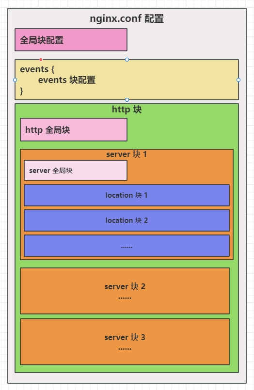

## 1、nginx.conf 结构说明




### 1.1 全局块

主要设置一些影响 Nginx 服务器整体运行的配置指令。如：`worker_processes  1;` ，`worker_processes` 值越大，可以支持更多的并发链接。设置 Nginx 使用的工作进程数，通常与服务器的 CPU 核心数相匹配。

```
# user: 指定运行 Nginx 工作进程的用户和组，默认为 nobody 或 www-data。
#user  nobody;

# worker_processes: 设置 Nginx 使用的工作进程数，通常与服务器的 CPU 核心数相匹配。`worker_processes` 值越大，可以支持更多的并发链接。
worker_processes  1;

# error_log: 定义全局错误日志的文件路径及日志级别。
#error_log  logs/error.log;
#error_log  logs/error.log  notice;
#error_log  logs/error.log  info;

# pid: 设置 Nginx 主进程的 PID 文件路径。
#pid        logs/nginx.pid;
```

### 1.2 events 块

`events` 块涉及的指令主要影响 Nginx 服务器与用户的网络连接。

```
events {
    # worker_connections: 每个工作进程能同时打开的最大连接数。
    worker_connections  1024;
}
```

### 1.3 http 块

`http` 块包括 `http 全局块`和 `server 块`，是服务器配置中最频繁的部分，包括配置代理、缓存、日志定义等绝大多数功能。

- `server 块` :  配置虚拟主机的相关参数；
- `location 块` :  配置请求的路由规则，以及路由规则对应的处理逻辑。

```
http {
    # include mime.types: 引入 MIME 类型映射文件
    include       mime.types;
    # 设定默认的 MIME 类型，用于未明确定义类型的文件
    default_type  application/octet-stream;

    # 自定义日志格式
    #log_format  main  '$remote_addr - $remote_user [$time_local] "$request" '
    #                  '$status $body_bytes_sent "$http_referer" '
    #                  '"$http_user_agent" "$http_x_forwarded_for"';

    # 定义访问日志的文件路径及格式
    #access_log  logs/access.log  main;

    # 开启高效文件传输模式，默认是开启状态（on），将 tcp_nopush 和 tcp_nodelay 两个指令设置为 on 用于防止网络阻塞；
    # 使用linux的sendfi1e(socket，file，1en)高效网络传输，也就是数据0拷贝
    sendfile        on;
    #tcp_nopush     on;

    # 持久连接（Keep-Alive）的超时时间。
    # 当客户端与Nginx服务器之间启用HTTP Keep-Alive连接时，允许在一个TCP连接上连续发送多个HTTP请求，
    # 而不是为每个请求都新建一个TCP连接。这样可以减少建立新连接的开销，提高HTTP请求的效率。
    #keepalive_timeout  0;
    keepalive_timeout  65;

    # gzip 压缩功能，默认处于开启状态
    #gzip  on;

    # 网站配置区域，一个 server 指一个虚拟主机 vhost
    server {
        # 默认监听80端口
        listen       80;
        # 提供服务的域名主机名，域名或IP 如：baidu.com www.baidu.com 192.168.1.110
        server_name  localhost;

        #charset koi8-r;

        #access_log  logs/host.access.log  main;

        # location 用于根据客户端请求的 URI（统一资源标识符）来匹配请求并执行相应的操作，如提供静态文件服务、代理请求到后端服务器、重定向等
        location / {
            # root 代表根目录，这里指的是 /usr/local/nginx/html 目录下
            # html 是一个目录名，它相对于 Nginx 安装目录（或在配置文件中通过 alias 指令指定的其他基路径）的相对路径。
            root   html;
            # 默认访问的文件
            index  index.html index.htm;
        }

        #error_page  404              /404.html;

        # redirect server error pages to the static page /50x.html
        #
        # error_page 指服务器端发生错误，比如返回500 502 503 504时，跳转到/50x.html文件。
        # http://example.com/50x.html，但是上面的location /默认没有指定该文件，所以下面的location = /50x.html 
        # 判断后会在html目录找该文件。
        error_page   500 502 503 504  /50x.html;
        location = /50x.html {
            root   html;
        }

        # proxy the PHP scripts to Apache listening on 127.0.0.1:80
        #
        #location ~ \.php$ {
        #    proxy_pass   http://127.0.0.1;
        #}

        # pass the PHP scripts to FastCGI server listening on 127.0.0.1:9000
        #
        #location ~ \.php$ {
        #    root           html;
        #    fastcgi_pass   127.0.0.1:9000;
        #    fastcgi_index  index.php;
        #    fastcgi_param  SCRIPT_FILENAME  /scripts$fastcgi_script_name;
        #    include        fastcgi_params;
        #}

        # deny access to .htaccess files, if Apache's document root
        # concurs with nginx's one
        #
        #location ~ /\.ht {
        #    deny  all;
        #}
    }


    # another virtual host using mix of IP-, name-, and port-based configuration
    #
    #server {
    #    listen       8000;
    #    listen       somename:8080;
    #    server_name  somename  alias  another.alias;

    #    location / {
    #        root   html;
    #        index  index.html index.htm;
    #    }
    #}


    # HTTPS server
    #
    #server {
    #    listen       443 ssl;
    #    server_name  localhost;

    #    ssl_certificate      cert.pem;
    #    ssl_certificate_key  cert.key;

    #    ssl_session_cache    shared:SSL:1m;
    #    ssl_session_timeout  5m;

    #    ssl_ciphers  HIGH:!aNULL:!MD5;
    #    ssl_prefer_server_ciphers  on;

    #    location / {
    #        root   html;
    #        index  index.html index.htm;
    #    }
    #}

}
```

## 2、Nginx 配置文件（去掉注释）

在日常查看文件时，可以使用 `cat nginx.conf | grep -v '#'` 过滤掉含 # 符号的行。更进一步，使用 `cat nginx.conf | grep -v '#' | grep -v '^$'` 去掉注释和空行，如下：

```
worker_processes  1;
events {
    worker_connections  1024;
}
http {
    include       mime.types;
    default_type  application/octet-stream;
    sendfile        on;
    keepalive_timeout  65;
    server {
        listen       80;
        server_name  localhost;
        location / {
            root   html;
            index  index.html index.htm;
        }
        error_page   500 502 503 504  /50x.html;
        location = /50x.html {
            root   html;
        }
    }
}

```

## 3、location，root 和 alias 指令区别

在 Nginx 配置中，`root` 和 `alias` 指令都用于指定请求的资源路径。这两者的用法区别在于对 `URI` 的处理方法不同：

### 3.1 **root 指令：**

```
location /index {
    root   html/admin;
    index  index.html index.htm;
}
```

如上， `root` 设置为 `html/admin`，且 `location /index` 处理请求。若按照上述配置，访问 `/index/` 目录里面的文件时，Nginx 会直接去 `/usr/local/nginx/html/admin/index` 目录下找文件。

### 3.2 **alias 指令：**

```
location /images {
    alias   html/admin/;
    index  index.html index.htm;
}
```

如上，`alias`设置为 `html/admin/`，在相同的 `location /index` 处理图像请求。若按照上述配置，访问 `/index/` 目录里面的文件时，Nginx 会直接去 `/usr/local/nginx/html/admin` 目录下找文件。

**注意：**

- `root` 适用于当你希望 URI 的剩余部分与文件系统路径直接组合的情况；
- `alias` 适用于需要将一个固定的 URI 映射到文件系统中的一个确切目录时，特别是当 URI 和 文件系统的目录结构不完全匹配时；
- `alias` 通常比 `root` 复杂，`alias` 会处理路径结尾的斜线以及如，URL重写和内部重定向时，可能需要额外的处理。而 `root` 相对简单，但灵活性较低。


### 3.3 举例说明

```
[root@iZbp1d8rn0652ia3bzzmioZ html]# tree -L 2
.
├── 50x.html
├── admin
│   ├── 1.png
│   └── index.html
└── index.html

1 directory, 4 files

```

修改 `nginx.conf` 配置文件，如下：

```
server {
    listen       80;
    server_name  localhost;
    location / {
        root   html;
        index  index.html index.htm;
    }
    
    location /index {
        alias   html/admin/;
        index  index.html index.htm;
    }
    
    location ~ ^/images/(.+\.(?:gif|jpe?g|png))${
        alias   html/admin/$1;
    }

    
    error_page   500 502 503 504  /50x.html;
    location = /50x.html {
        root   html;
    }
}
```

访问：

```
http://127.0.0.1/index/

http://127.0.0.1/images/1.png

```


 


