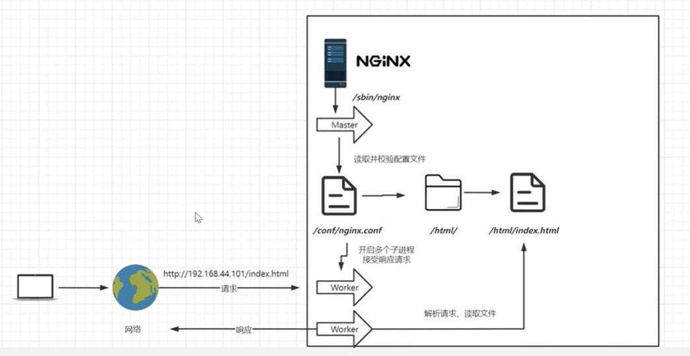

**Nginx** 在启动时会以 `daemon` 形式在后台运行，采用 **多进程 + 异步非阻塞 IO 事件模型** 来处理各种网络请求。多进程模型包括一个 `master` 进程和多个 `worker` 进程，每个 `worker` 进程都有一个 `event loop` 事件循环，用来处理网络请求。



## Master Process

Nginx 启动时，首先会生成一个主进程。主进程主要负责管理子进程、加载和验证配置文件、维护工作进程池以及响应信号（如重新加载配置、优雅关闭等）。主进程不直接参与处理客户端请求。

## Worker Process

一般 `worker` 进程个数是根据服务器的CPU核心数来确定的。进程数量通常与服务器的CPU核心数相匹配，以充分利用硬件资源。主进程会根据配置文件中指定的数量创建多个工作进程。每个工作进程都能够独立处理客户端的请求，包括接收请求、处理请求、返回响应等。

如，使用 `.nginx -s reload` 命令，`Master` 会将 `Worker` 进程 Kill 掉，Kill 之前会留有一段时间让当前的 Worker 进程处理完手上的请求，不再接收新的请求了。Kill 掉之后创建一个新的 Worker 进程，配置文件读取的也是最新的。

## 查看进程

```
[root@iZbp1d8rn0652ia3bzzmioZ ~]# ps -ef|grep nginx
root      1549     1  0 02:08 ?        00:00:00 nginx: master process /usr/local/nginx/sbin/nginx -c /usr/local/nginx/conf/nginx.conf
nobody    1550  1549  0 02:08 ?        00:00:00 nginx: worker process
root     28449 28421  0 22:11 pts/0    00:00:00 grep --color=auto nginx
```

## 参考资料

- [1] [通俗易懂的Nginx工作原理](https://cloud.tencent.com/developer/article/1427219)
- [2] [Nginx 工作原理简介](https://cloud.tencent.com/developer/article/2371864)
- [3] [Nginx的配置说明](https://zhuanlan.zhihu.com/p/547563033)