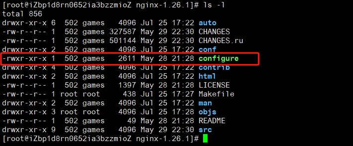

此处使用 CentOS 7.9 系统，通过源码编译安装的方式安装 Nginx。 

# 1、环境要求

在编译和安装 Nginx 前，需要确保系统中已经安装了以下依赖项：

- GNU C 和 C++ 编译器
- PCRE (Perl Compatible Regular Expressions) 库
- zlib 压缩库
- OpenSSL 库

可以使用以下命令在 CentOS 系统中安装以上依赖项：

```
yum install -y gcc-c++ pcre pcre-devel zlib zlib-devel openssl openssl-devel
```

分步安装依赖及说明：

## 1.1 安装 gcc

`Nginx` 是 `C` 语言开发的源码包，需要 `C` 编译器才能安装。

```
yum install -y gcc-c++
```

## 1.2 安装 `pcre` `pcre-devel`

`PCRE(Perl Compatible Regular Expressions)` 是一个 `perl` 库，包括 `perl` 兼容的正则表达式库。`Nginx` 的 `http` 模块使用 `pcre` 来解析正则表达式.

`pcre-devel` 是使用 pcre 开发的一个二次开发库。

```
yum install -y pcre pcre-devel
```

## 1.3 安装 `zlib`

`zlib` 库提供了很多种压缩和解压缩的方式，`Nginx` 使用 `zlib` 对 `http` 包的内容进行 `gzip`。

```
yum install -y zlib zlib-devel
```

## 1.4 安装 `OpenSSL`

`OpenSSL` 是一个强大的安全套接字层密码库，囊括主要的密码算法、常用的密钥和证书封装管理功能及 `SSL` 协议，并提供丰富的应用程序供测试或其它目的使用。

`Nginx` 不仅支持 `http` 协议，还支持 `https`，需要 `OpenSSL` 库的支持。

```
yum install -y openssl openssl-devel
```

# 2、下载源码

可以从 [Nginx 官方网站](https://nginx.org/en/download.html)，下载最新的稳定版本，如：

```
wget https://nginx.org/download/nginx-1.26.1.tar.gz
```


# 3、编译及安装

下载完成后，需要解压并进入源码目录：

```
tar -zxvf nginx-1.26.1.tar.gz
cd nginx-1.26.1
```

进入源码目录：



`configure` 是一个一个 Shell脚本，用于检测系统环境、配置编译选项以及生成相应的 Makefile 文件。

Makefile 文件是软件工程中的一种自动化构建工具文件，主要用于 Unix-like 操作系统（如Linux、BSD等）和一些集成开发环境（IDEs），用于管理和自动化编译、链接程序的过程。在 Makefile 中，开发者定义了一系列规则来指导 make 工具如何编译和链接源代码文件，以生成最终的目标文件（通常是可执行文件或库文件）。

在实际使用中，程序员通过编写 Makefile 来组织和控制整个项目的构建流程，只需简单地运行 make 命令，make 工具就会读取 Makefile 文件，分析依赖关系，并执行必要的编译和链接步骤来生成最终的产品。

## 3.1 编译配置

使用以下命令进行编译配置，默认会放到 `/usr/local/nginx` 目录下。
```
./configure
```

## 3.2 开始编译

完成配置后，可以使用以下命令开始编译：

```
make
```

## 3.3 安装

编译完成后，可以使用以下命令安装 Nginx:
```
sudo make install
```
将 Nginx 可执行文件连接到系统 PATH 中的目录：
```
sudo ln -s /usr/local/nginx/sbin/nginx /usr/sbin/nginx
```

## 3.4 查看是否安装成功

> **nginx -v**: 查看nginx版本号

```
[root@iZbp1d8rn0652ia3bzzmioZ sbin]# ./nginx -v
nginx version: nginx/1.26.1
```
输出 Nginx 的版本号说明安装成功。

> **nginx -V**: 查看nginx的详细信息

```
[root@iZbp1d8rn0652ia3bzzmioZ sbin]# ./nginx -V
nginx version: nginx/1.26.1
built by gcc 4.8.5 20150623 (Red Hat 4.8.5-44) (GCC) 
built with OpenSSL 1.0.2k-fips  26 Jan 2017
TLS SNI support enabled
configure arguments: --with-threads --with-http_stub_status_module --with-http_ssl_module --with-http_realip_module --with-stream --with-stream_ssl_module

```
**注意：** 这里我使用以下命令进行编译配置：
```
./configure \
 --with-threads \
 --with-http_stub_status_module \
  --with-http_ssl_module \
  --with-http_realip_module \
  --with-stream \
  --with-stream_ssl_module
```
其中 `--with-http_ssl_module` 参数用于添加 SSL 功能支持，`--with-stream` 与 `--with-stream_ssl_module` 参数用于添加 TCP 反向代理支持。


# 4、验证 Nginx

打开浏览器，输入 `ip` 地址，如下图，页面会显示 `Welcome to nginx!`。


# 5、开始使用

进入 `/usr/local/nginx/` 目录，查看相关文件：

- conf：配置文件
- html：存放静态文件的目录
- logs：存放日志文件的目录
- sbin：存放启动脚本的目录

进入 `/usr/local/nginx/sbin` 目录，执行以下命令操作 Nginx：

## 5.1 检查配置文件
```
./nginx -t
```
Nginx 配置文件验证成功，则可以启动 Nginx。
```
[root@iZbp1d8rn0652ia3bzzmioZ sbin]# ./nginx -t
nginx: the configuration file /usr/local/nginx/conf/nginx.conf syntax is ok
nginx: configuration file /usr/local/nginx/conf/nginx.conf test is successful
```

## 5.2 启动
```
./nginx
```

`ps -ef | grep nginx` 检查启动情况：

```
[root@iZbp1d8rn0652ia3bzzmioZ nginx-1.26.1]# ps -ef | grep nginx
root       413 29638  0 01:49 pts/0    00:00:00 grep --color=auto nginx
root     26906     1  0 Jul25 ?        00:00:00 nginx: master process ./nginx
nobody   26907 26906  0 Jul25 ?        00:00:00 nginx: worker process
```

## 5.3 停止
```
./nginx -s stop
```

## 5.4 优雅关闭，在退出前完成已经接收的连接请求
```
./nginx -s quit
```

## 5.5 重新加载正在运行的 Nginx 并应用新配置

建议在操作前检查配置是否无误，否则可能会导致服务异常。`reload` 其实是创建了新线程 Work 来替换的老的线程 Work。

```
./nginx -s reload
```

# 6、配置成系统服务

使用 `systemctl` 命令启动 Nginx 服务 前，请使用 `./nginx -s stop` 命令关闭用原来的方式 `./nginx` 启动的 Nginx 服务。如果你的 Nginx 非默认安装路径，请修改 Nginx 系统服务文件内容中的路径。

## 6.1 编辑Nginx系统服务文件：

```
vi /usr/lib/systemd/system/nginx.service
```

## 6.2 Nginx 服务脚本内容如下：

```
[Unit]
Description=nginx - web server
After=network.target remote-fs.target nss-lookup.target

[Service]
Type=forking
PIDFile=/usr/local/nginx/logs/nginx.pid
ExecStartPre=/usr/local/nginx/sbin/nginx -t -c /usr/local/nginx/conf/nginx.conf
ExecStart=/usr/local/nginx/sbin/nginx -c /usr/local/nginx/conf/nginx.conf
ExecReload=/usr/local/nginx/sbin/nginx -s reload
ExecStop=/usr/local/nginx/sbin/nginx -s stop
PrivateTmp=true

[Install]sys
WantedBy=multi-user.target
```

## 6.3 重新加载系统服务

```
systemctl daemon-reload
```

## 6.4 使用 `systemctl` 操作 Nginx 服务

### 6.4.1 启动 Nginx 服务

```
systemctl start nginx
```

### 6.4.2 停止 Nginx 服务

```
systemctl stop nginx
```
### 6.4.3 重启 Nginx 服务

```
systemctl restart nginx
```

### 6.4.4 查看 Nginx 服务状态

```
systemctl status nginx
```

### 6.4.5 开机自启动 Nginx 服务

```
systemctl enable nginx
```

### 6.4.6 禁止 Nginx 服务开机启动

```
systemctl disable nginx
```