## 一、打开官网

安装包可通过 `node` 官方网站直接下载，地址：`https://nodejs.org/zh-cn/`。国内打开速度较慢甚至打不开，可尝试选择访问 `http://nodejs.cn/`


点击**下载安装**有两个版本，一个是 `LTS` 长期支持版本，一个是 `Current` 当前版本，企业项目建议下载长期支持版本。


选择对应的系统支持的版本，点击下载即可。

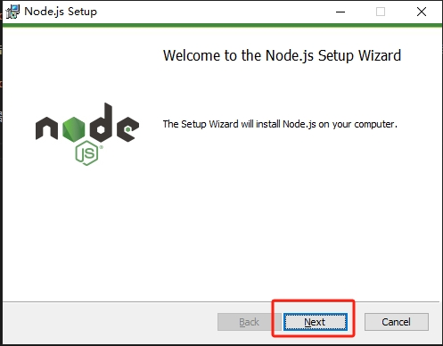

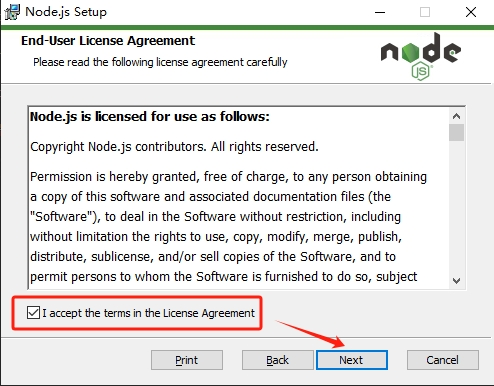

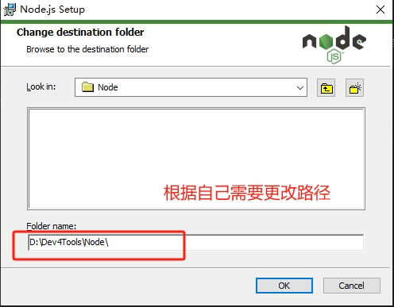

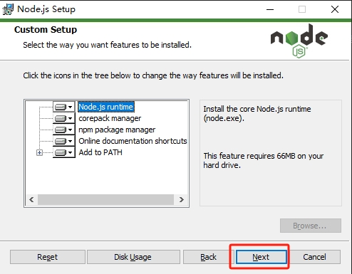

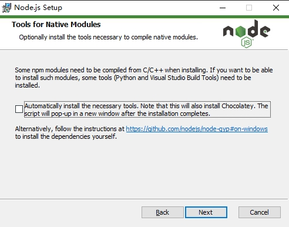

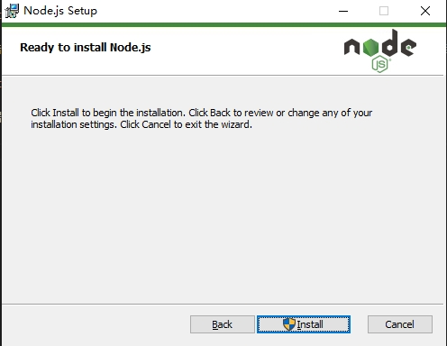

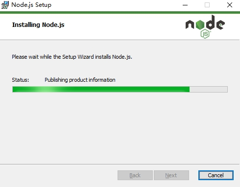

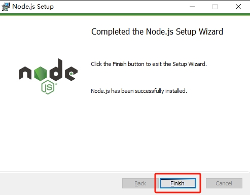

根据安装提示，一路 `next` 即可。安装完成后，检查是否安装成功。

## 二、检查安装

命令 `win + R`，输入 `cmd` 命令行：

1、输入 `node -v` 检查是否安装成功，出现版本号，表示安装成功。

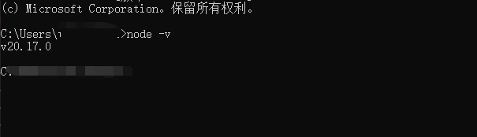

2、输入 `npm -v` 检查是否安装成功，出现版本号，表示安装成功。

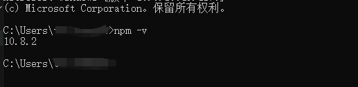


## 三、对应的各个文件的介绍

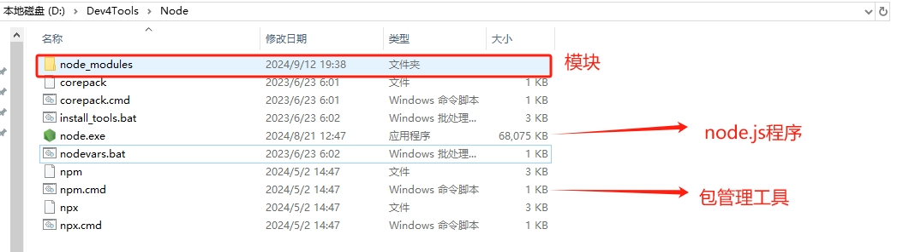

## 四、配置 npm

### 4.1 修改 npm 的全局目录路径

npm 安装包的默认路径：`C:\Users\bamaw\AppData\Roaming\npm`

> 查看当前 prefix 路径

```
npm config get prefix
C:\Users\bamaw\AppData\Roaming\npm
```

> 修改 prefix 路径

在 `node` 目录下，创建一个文件夹 `node_global`，路径为：`D:\Dev4Tools\Node\node_global`

```
npm config set prefix "D:\Dev4Tools\Node\node_global"
npm config get prefix

output:
D:\Dev4Tools\Node\node_global
```

### 4.2 修改 npm 的缓存目录路径

npm 安装包的默认缓存路径：`C:\Users\bamaw\AppData\Roaming\npm-cache`

> **查看当前 cache 路径**

```
C:\Users\bamaw>npm config get cache
C:\Users\bamaw\AppData\Roaming\npm-cache
```

> **修改 cache 路径**

在 `node` 目录下，创建一个文件夹 `node_cache`，路径为：`D:\Dev4Tools\Node\node_cache`

```
npm config set cache "D:\Dev4Tools\Node\node_cache"
npm config get cache

output:
D:\Dev4Tools\Node\node_cache
```

### 4.3 修改系统变量及用户变量

> **在系统环境变量添加NODE_PATH**

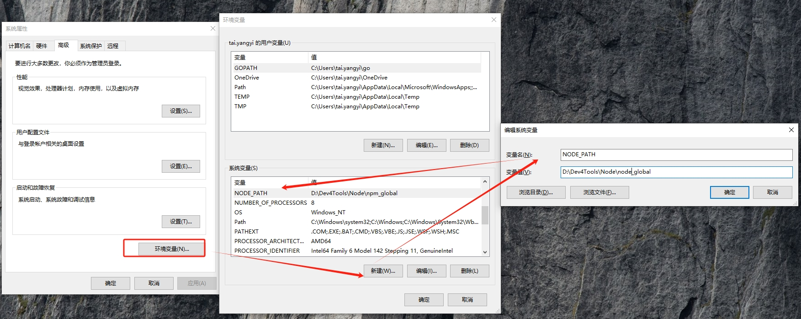

> **在用户变量的 PATH 中新增 NODE_PATH**

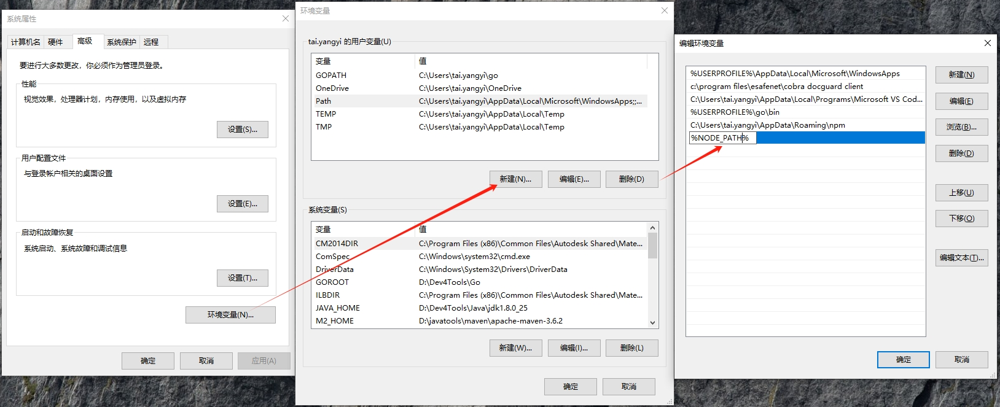


### 4.4 npm 镜像源配置

> **查看当前镜像源**

```
npm get register
```

> **设置镜像源**

```
# 官方原始镜像源
npm config set registry=https://registry.npmjs.org/

# 淘宝镜像源
npm config set registry=http://registry.npm.taobao.org

# 中国镜像站
npm config set registry=https://npmmirror.com/
```

### 5、显示所有配置信息

```
npm config list
```

```
; "builtin" config from D:\Dev4Tools\Node\node_modules\npm\npmrc

; prefix = "C:\\Users\\bamaw\\AppData\\Roaming\\npm" ; overridden by user

; "user" config from C:\Users\bamaw\.npmrc

cache = "D:\\Dev4Tools\\Node\\npm_cache"
prefix = "D:\\Dev4Tools\\Node\\npm_prefix"
registry = "http://registry.npm.taobao.org"

; node bin location = D:\Dev4Tools\Node\node.exe
; node version = v20.17.0
; npm local prefix = C:\Users\bamaw
; npm version = 10.8.2
; cwd = C:\Users\bamaw
; HOME = C:\Users\bamaw
; Run `npm config ls -l` to show all defaults.
```

## 五、验证获取 vue 信息

如果是管理员账户下，那么系统能正常输出。如果是普通账户下，那么会报错。

```
npm info vue
```

普通用户报错，npm ERR code EPERM的解决过程：

```
C:\Users\bamaw>npm info vue
npm error code EPERM
npm error syscall open
npm error path D:\Dev4Tools\Node\node_cache\_cacache\index-v5\4b\d5\ac02d8eac51f5c368b18a948d14b7ba882d43e6f4cafddbf9dda740d2afa
npm error errno -4048
npm error Error: EPERM: operation not permitted, open 'D:\Dev4Tools\Node\node_cache\_cacache\index-v5\4b\d5\ac02d8eac51f5c368b18a948d14b7ba882d43e6f4cafddbf9dda740d2afa'
npm error     at async open (node:internal/fs/promises:639:25)
npm error     at async writeFile (node:internal/fs/promises:1212:14)
npm error     at async Object.insert (D:\Dev4Tools\Node\node_modules\npm\node_modules\cacache\lib\entry-index.js:136:5)
npm error     at async CacheEntry.store (D:\Dev4Tools\Node\node_modules\npm\node_modules\make-fetch-happen\lib\cache\entry.js:308:7)
npm error     at async fetch (D:\Dev4Tools\Node\node_modules\npm\node_modules\make-fetch-happen\lib\fetch.js:98:7)
npm error     at async RegistryFetcher.packument (D:\Dev4Tools\Node\node_modules\npm\node_modules\pacote\lib\registry.js:90:19)
npm error     at async #getData (D:\Dev4Tools\Node\node_modules\npm\lib\commands\view.js:135:20)
npm error     at async #viewPackage (D:\Dev4Tools\Node\node_modules\npm\lib\commands\view.js:112:28)
npm error     at async View.exec (D:\Dev4Tools\Node\node_modules\npm\lib\commands\view.js:70:5)
npm error     at async Npm.exec (D:\Dev4Tools\Node\node_modules\npm\lib\npm.js:207:9) {
npm error   errno: -4048,
npm error   code: 'EPERM',
npm error   syscall: 'open',
npm error   path: 'D:\\Dev4Tools\\Node\\node_cache\\_cacache\\index-v5\\4b\\d5\\ac02d8eac51f5c368b18a948d14b7ba882d43e6f4cafddbf9dda740d2afa'
npm error }
npm error
npm error The operation was rejected by your operating system.
npm error It's possible that the file was already in use (by a text editor or antivirus),
npm error or that you lack permissions to access it.
npm error
npm error If you believe this might be a permissions issue, please double-check the
npm error permissions of the file and its containing directories, or try running
npm error the command again as root/Administrator.
npm error Log files were not written due to an error writing to the directory: D:\Dev4Tools\Node\node_cache\_logs
npm error You can rerun the command with `--loglevel=verbose` to see the logs in your terminal

```

### 5.1 问题原因

没有管理员权限，无法在 `node_global` 和 `node_cache` 两个文件夹下进行一些必要的操作。

### 5.2 解决办法

- 删除用户下的.npmrc文件，即不改变全局安装的路径（不够好，本质问题仍没有解决，全局还是会安装在C盘）
- 每次都用管理员身份运行命令行（不够方便，vscode 下的命令行默认也不是管理员身份运行的）
- 直接修改node_global和node_cache文件夹的权限：

右键文件夹，打开属性，切换到安全选项卡，选择编辑，将没有打钩的位置全部打上钩（即将其它用户的权限设置为与管理员相同），应用即可。

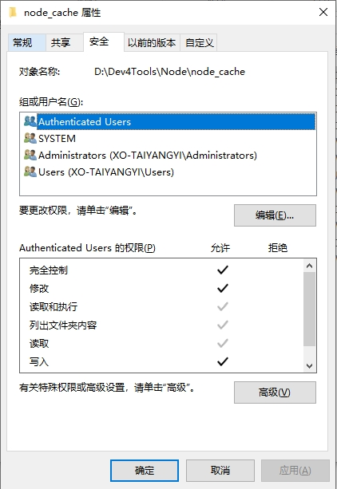

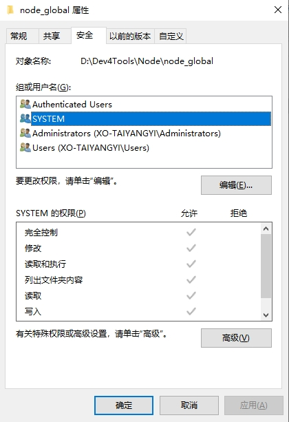

### 5.3 验证 npm info vue

```
C:\Users\bamaw>npm info vue

vue@3.5.4 | MIT | deps: 5 | versions: 522
The progressive JavaScript framework for building modern web UI.
https://github.com/vuejs/core/tree/main/packages/vue#readme

keywords: vue

dist
.tarball: https://registry.npmmirror.com/vue/-/vue-3.5.4.tgz
.shasum: 0e5935e8b1e5505d484aee732b72c6e77c7567fd
.integrity: sha512-3yAj2gkmiY+i7+22A1PWM+kjOVXjU74UPINcTiN7grIVPyFFI0lpGwHlV/4xydDmobaBn7/xmi+YG8HeSlCTcg==
.unpackedSize: 2.4 MB
...
```

### 5.4 使用 npm 安装 vue.js

```
npm install vue -g
```

- npm 安装命令
- vue 模块
- -g 放在全局目录

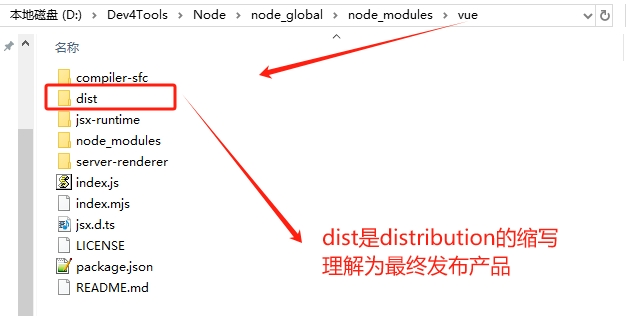


