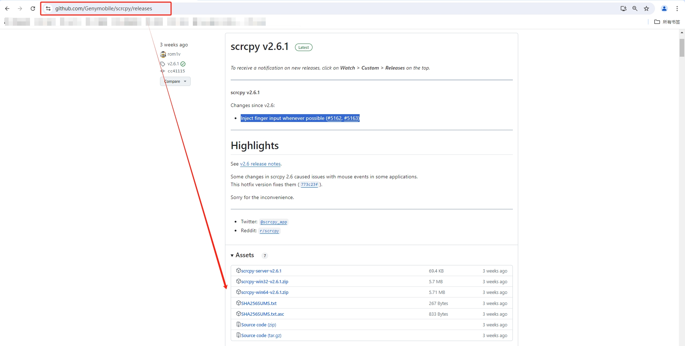
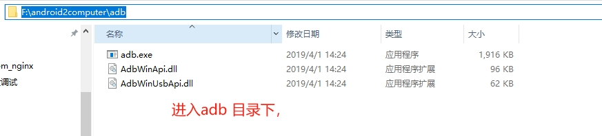
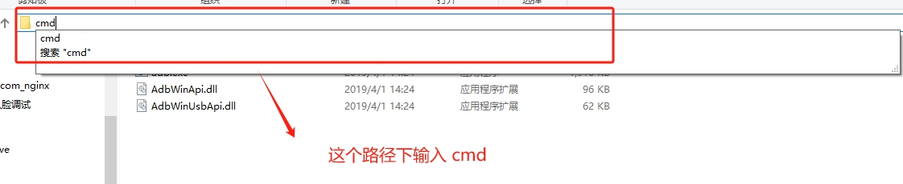
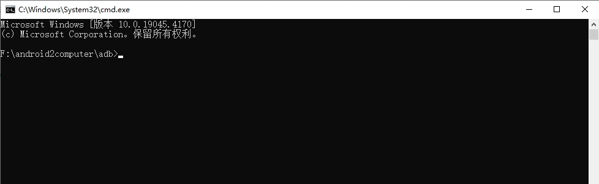
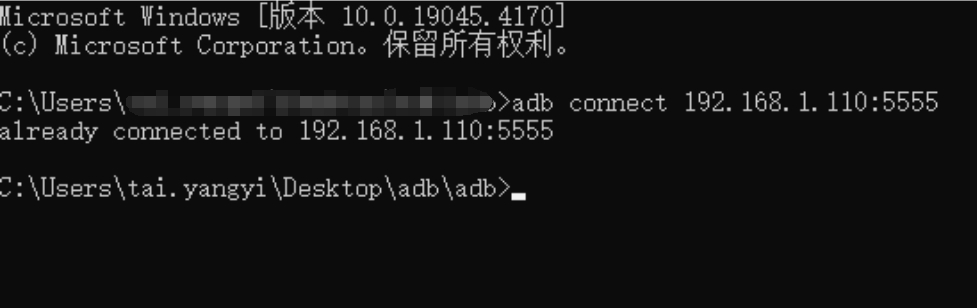
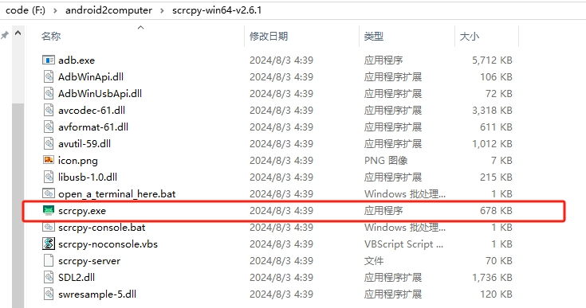
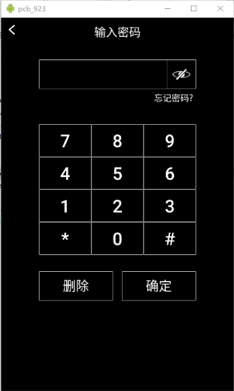

## 需求

需要将 Android 设备的某个 APP 界面的各个配置界面的高清图片截取下来，用于做调试手册。因为 UI 图不完整且无法达到灵活配置截图的需求，所以需要借助 Scrcpy 工具。

## Scrcpy 介绍

```
github地址：https://github.com/Genymobile/scrcpy/
```

Scrcpy，读作 `screen copy` 是一个开源的 Android 设备调试工具，可以通过 USB 或 TCP/IP 将安卓设备的屏幕投屏到电脑显示器上，并进一步通过鼠标和键盘操作电脑显示器上的手机屏不进而操作手机，且不需要任何 root 权限。并支持 Windows、Linux、MacOS 等操作系统。

## Scrcpy 下载

介绍地址：https://github.com/Genymobile/scrcpy/
中文介绍：https://github.com/Genymobile/scrcpy/wiki/README.zh-Hans
下载地址：https://github.com/Genymobile/scrcpy/releases

在 `Scrcpy` 的 `releases` 页面中，选择 `Scrcpy` 系统对应的版本，然后点击 `Download` 下载。



本次使用的是 `windows 64` 电脑，故下载 `scrcpy-win64-v2.6.1.zip`，然后，解压这个 zip 文件。

## 使用方式

1、将 Android 设置的 IP 相关信息 与 电脑的 IP 相关信息 配置好；
如：电脑 IP 地址为 `192.168.1.100`，Android IP 地址为 `192.168.1.101`，网关地址为 `192.168.1.1`，子网掩码为 `255.255.255.0`。

2、使用网线将 Android 设备 与 电脑 直连；

3、准备 `adb` 环境 和 下载好的 `scrcpy` 安装包，打开 `cmd` 窗口，使用命令：`adb connect 安卓设备IP:5555`









提示：already connected to 192.168.1.100:5555，显示连接成功。

4、双击打开 `scrcpy.exe` 文件，即可使用 Scrcpy 工具。






